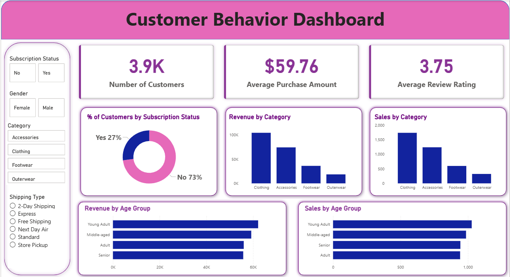

# 🛍️ Customer Shopping Behavior Analysis

**End-to-end data analytics project** — cleaning and feature engineering in Python, business-question analysis in MySQL, and an interactive Power BI dashboard, built on 3,900 real retail transactions.


---

## 📌 Business Problem

A retail company wants to understand what actually drives its customers' purchase decisions — discounts, reviews, seasonality, payment method, subscriptions — so it can improve sales, engagement, and long-term loyalty.

> **Business question:** *How can the company leverage consumer shopping data to identify trends, improve customer engagement, and optimize marketing and product strategies?*

This project answers that using the full analytics workflow, start to finish:

1. **Python** — cleans the raw dataset and engineers new features
2. **MySQL** — the cleaned data is loaded into a MySQL database and queried to answer 10 business questions
3. **Power BI** — turns the SQL findings into an interactive dashboard
4. **Report & recommendations** — translates the analysis into concrete stakeholder actions

---

## 📊 Dashboard



---

## 🗂️ Dataset

| | |
|---|---|
| **Rows** | 3,900 transactions |
| **Columns** | 18 |
| **Fields** | Demographics (age, gender, location), purchase details (item, category, amount, season, size, color), and behavior (discount applied, previous purchases, purchase frequency, review rating, subscription status, shipping type, payment method) |
| **Data quality** | 37 missing values in `Review Rating`, imputed using the median rating per product category |

---

## 🧹 Data Preparation (Python)

All cleaning and feature engineering is done in `customer_shopping_behavior.ipynb`:

- **Missing values** — imputed `Review Rating` nulls with the median rating *within that product's category*, rather than a single global median, to keep category-level rating patterns intact
- **Column standardization** — renamed every column to snake_case for consistency across Python and SQL
- **Feature engineering:**
  - `age_group` — customers binned into Young Adult / Adult / Middle-aged / Senior
  - `purchase_frequency_days` — mapped every value in `frequency_of_purchases` (Weekly, Bi-Weekly, Fortnightly, Monthly, Quarterly, Every 3 Months, Annually) to a numeric day count for aggregation
- **Redundancy check** — confirmed `discount_applied` and `promo_code_used` were identical across all rows and dropped the duplicate column
- **Database load** — loaded the cleaned DataFrame into **MySQL** via SQLAlchemy + PyMySQL, ready for SQL analysis

---

## 🗃️ SQL Analysis & Results (MySQL)

Ten business questions were answered in `customer_behavior_sql_queries.sql`, using aggregations, subqueries, `CASE` logic, CTEs, and window functions:

| # | Business Question | Technique | Key Result |
|---|---|---|---|
| 1 | Revenue by gender | `GROUP BY`, `SUM` | Male customers generated **$157,890** vs. **$75,191** from female customers |
| 2 | Discount users spending above average | Correlated subquery | 839 customers used a discount while still spending above the $59.76 average |
| 3 | Top 5 products by average rating | `GROUP BY`, `ORDER BY` | Gloves (3.86), Sandals (3.84), Boots (3.82), Hat (3.80), Skirt (3.78) |
| 4 | Standard vs. Express shipping — avg. spend | `GROUP BY`, `AVG` | Express ($60.48) slightly outspends Standard ($58.46) |
| 5 | Subscribers vs. non-subscribers | `GROUP BY`, aggregation | Non-subscribers (2,847 customers) drive **$170,436** vs. subscribers' **$62,645** — but per-customer average spend is nearly identical ($59.87 vs. $59.49) |
| 6 | Top 5 most discount-dependent products | Conditional aggregation (`CASE WHEN`) | Hat (50% of purchases discounted), Sneakers (49.7%), Coat (49.1%), Sweater (48.2%), Pants (47.4%) |
| 7 | Customer segmentation (New/Returning/Loyal) | `CASE`, CTE | Loyal: 3,116 · Returning: 701 · New: 83 |
| 8 | Top 3 products per category | Window function (`ROW_NUMBER() OVER PARTITION BY`) | e.g. Jewelry leads Accessories (171 orders), Blouse leads Clothing (171), Jacket leads Outerwear (163) |
| 9 | Repeat buyers (5+ purchases) vs. subscription | Filtered `GROUP BY` | Of repeat buyers, 2,518 are non-subscribers vs. only 958 subscribers |
| 10 | Revenue by age group | `GROUP BY`, `SUM` | Young Adult ($62,143) > Middle-aged ($59,197) > Adult ($55,978) > Senior ($55,763) |

<details>
<summary>Example query — top 3 products per category (window function)</summary>

```sql
WITH item_counts AS (
    SELECT category,
           item_purchased,
           COUNT(customer_id) AS total_orders,
           ROW_NUMBER() OVER (PARTITION BY category ORDER BY COUNT(customer_id) DESC) AS item_rank
    FROM customer
    GROUP BY category, item_purchased
)
SELECT item_rank, category, item_purchased, total_orders
FROM item_counts
WHERE item_rank <= 3;
```
</details>

---

## 💡 Key Findings & Business Recommendations

- **The 73/27 subscription split is the standout number.** Only 27% of customers subscribe, and among repeat buyers (5+ purchases) non-subscribers still outnumber subscribers by more than 2.5:1 — this is the clearest growth lever in the dataset. → **Promote exclusive subscriber-only benefits** to convert loyal, high-frequency shoppers who haven't subscribed yet.
- **93% of the customer base already qualifies as "Loyal"** (3,116 of 3,900) under the purchase-count segmentation, with very few "New" customers (83) — suggesting the company retains customers well but may be under-investing in top-of-funnel acquisition. → **Build a loyalty rewards tier** to keep monetizing this base, while separately tracking acquisition of genuinely new customers.
- **Discount dependency is concentrated in a handful of products** — Hats, Sneakers, and Coats all have ~50% of their sales tied to a discount. → **Review discount policy** on these specific items to protect margin, since they may be underpriced relative to demand rather than needing constant promotion.
- **Male customers generate roughly double the revenue of female customers** ($157,890 vs. $75,191) despite similar average order values — pointing to a difference in purchase volume rather than spend per transaction. → Worth investigating in category-level data whether this is a category-mix effect before acting on it.
- **Young Adults are the top revenue-driving age group** ($62,143), narrowly ahead of Middle-aged, Adult, and Senior segments, which are all within ~$6K of each other — revenue is fairly evenly spread across age groups, so **age-based targeting should be a secondary lever**, not a primary one.

---

## 🛠️ Tech Stack

- **Python** — pandas (cleaning, feature engineering)
- **MySQL** — business-question analysis (via SQLAlchemy + PyMySQL)
- **Power BI** — dashboard & visualization
- **Jupyter Notebook** — end-to-end analysis workflow

---

## 📁 Repository Structure

```
├── Business_Problem__Document.pdf              # Original business brief
├── customer_shopping_behavior.ipynb            # Data cleaning & feature engineering
├── customer_behavior_sql_queries.sql           # 10 business-question SQL queries (MySQL)
├── customer_behavior_dashboard.pbix            # Power BI dashboard
├── customer_shopping_behavior.csv              # Raw dataset
├── Customer_Shopping_Behavior_Analysis.pdf     # Full project report
├── Customer-Shopping-Behavior-Analysis.pptx    # Stakeholder presentation
├── assets/
│   └── dashboard.png                           # Dashboard screenshot
└── README.md
```

---

## 🚀 How to Reproduce

1. **Clone the repo**
   ```bash
   git clone <https://github.com/sunny1634/Customer_Shopping_Behavior_Analysis.git>
   cd customer-trends-data-analysis-SQL-Python-PowerBI
   ```
2. **Install dependencies**
   ```bash
   pip install pandas sqlalchemy pymysql
   ```
3. **Set your database credentials as environment variables** (never hardcode passwords):
   ```bash
   export MYSQL_PASSWORD="your_password_here"
   ```
4. **Run the notebook** — `customer_shopping_behavior.ipynb` cleans the data and loads it into a MySQL database named `customer_behaviour` (create this database first, or point the notebook at your own instance)
5. **Run the SQL queries** — execute `customer_behavior_sql_queries.sql` against the loaded `customer` table in MySQL Workbench (or any MySQL client)
6. **Open the dashboard** — `customer_behavior_dashboard.pbix` in Power BI Desktop

---

## 📬 Contact

If you have questions about the analysis or want to discuss the approach, feel free to reach out via [LinkedIn](https://www.linkedin.com/in/sunny-chaudhary-61811b306/) or [email](sunnychaudhary1029@gmail.com).
